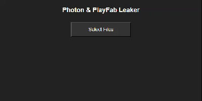

# Photon / PlayFab Leaker
## There are 3 versions:
- CMD Tool
- UI
- Web [Link](https://twhlynch.me/PlayFab-Photon-Leak)


# The following regards the CMD Tool

# Usage
Drag `PlayFab-Photon_Leak.py` into a directory containing `PlayFabSharedSettings-resources.assets-3655.dat` and `PhotonServerSettings-resources.assets-3654.dat`.

Then run it.

## Output should look something like:
`leaks.json`
```
{
    "playFab": {
        "title": "D90E4"
    },
    "photon": {
        "pun": "28ac06ac-b3dd-4018-83d8-eef66746be99",
        "voice": "c498f014-4986-4865-b660-7fd45d5ff1e8"
    }
}
```